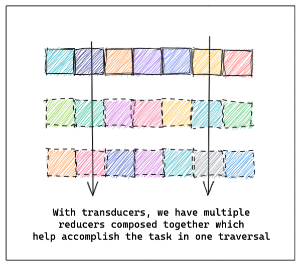

> ##### NOTE:
> I will be using a mix of JavaScript & TypeScript across the post. In case you aren't comfortable
> with these, let me know and I just might conjure up an example in your favourite language!
>
> Another thing I take for granted is that you understand how `reduce` works too. If not,
> feel free to check these articles and come back to this post:
>   - https://css-tricks.com/understanding-the-almighty-reducer/
>   - https://www.robinwieruch.de/javascript-reducer
>   - https://developer.mozilla.org/en-US/docs/Web/JavaScript/Reference/Global_Objects/Array/reduce
>
> Happy Learning! 🙌

The realm of functional programming is genuinely astounding. I've experienced a lot of joy in understanding and uncovering the plethora of ideas I've come across thus far. In this post(and possibly others in the future), I'd like to take a crack at sharing my excitement whilst exploring `transducers`! I hope that by the end, we'd share the same appreciation for them!

Some of us might've come across pure functions like `map`, `filter` and `reduce`(AKA `fold` in some programming languages). What each of these functions does, is quite simple. They run a function(callback/predicate) across each element of the list to produce new lists or produce other data structures, like in the case of `reduce`.

### Reduce is not magic but has almighty capabilities

I had a hard time understanding the working of `reduce` at first. When I finally understood it, I was in awe of its simplicity and blown away by the myriads of use-cases that it could fulfil. For starters, we can even rewrite `map` and `filter` using `reduce`!

```js react-live

// You can edit this! 😱

// The `map` function using reduce
const mapR = (inputList, mappingFn) => {
  return inputList.reduce((accumulatedValue, currentValue) => {
    return [...accumulatedValue, mappingFn(currentValue)];
  }, []);
};

// The `filter` function using reduce
const filterR = (inputList, predicate) => {
  return inputList.reduce((accumulatedValue, currentValue) => {
    if (predicate(currentValue)) {
      return [...accumulatedValue, currentValue];
    }
    return accumulatedValue;
  }, []);
};

// produces a list of numbers from 1 to 10
const numbers = Array.from({ length: 10 }, (_, index) => index + 1);

// increments the value by 1
const inc = num => num + 1;

const onClickMapBtn = () => {
  alert(mapR(numbers, inc));
};

// Remember that '0' is a `falsy` value in JS.
const isOdd = num => num % 2;

const onClickFilterBtn = () => {
  alert(filterR(numbers, isOdd));
};

// Click on the buttons to see the specific outputs :)
render(
  <>
    <button onClick={onClickMapBtn} style={{ marginRight: '8px' }}>
      Map
    </button>
    <button onClick={onClickFilterBtn}>Filter</button>
  </>
);

```

In brief, `reduce` consumes a `reducer` and `a starting value`, when needed. The `reducer` is a function that consumes two arguments:
  - `accumulator`: the value returned from the previous call to the `reducer`
  - `current value`: the value currently being evaluated

```ts

// The type signature for a reducer would look a lot like this
type Reducer<T, U> = (previousValue: U, currentValue: T) => U;

// Or as Rich Hickey writes:

// whatever, input -> whatever

// `whatever` is the result returned so far which eventually
// consumes a new input and returns the next `result-so-far`.

```

`reduce` is reasonably popular in the wild.


To list a few examples:
  - `useReducer` within React. [See Here](https://reactjs.org/docs/hooks-reference.html#usereducer)
  - [Redux](https://redux.js.org/)
  - Plenty of methods implemented in the `Iterator` trait use `reduce`/`fold`. [See Here](https://doc.rust-lang.org/src/core/iter/traits/iterator.rs.html#243-3416)
  - Evaluate values from an AST. [See Here](https://github.com/kolharsam/lisp-y/blob/83376658f4ce9640fe970a54e9b30e34416fcf7e/eval/index.js#L20)
  - and numerous others...

With this _power_ also comes great _responsibility_. Since we're traversing the list, one element at a time, performance might become a bottleneck in cases where the evaluation is _eager_ and you ought to perform multiple reduction steps to reach the required output. These multiple traversals often produce intermediate lists that usually don't serve any other purpose than just being the inputs to our subsequent reduction operations. 


### Enter: Transducers

Clojure developers are very familiar with the idea of transducers. Rich Hickey made sure that transducers had first-class support within Clojure from the very beginning. So I'm not surprised when I see memes like this one.


It would indeed be great if a lot more languages supported transducers out of the box. What makes transducers special is that they __"de-complect"__ or __"decouple"__ the `reducer`. 

> #### complect 
> ###### transitive verb
> meaning: to intertwine, embrace, plait together
>

To begin understanding this, we need to take another look at the `reducer`.

```ts

type Reducer<T, U> = (previousValue: U, currentValue: T) => U;

// or just
// whatever, input -> whatever

```

`reduce`, as we now know, isn't bothered by:
  - the context of use (what 'whatever' is, also meaning that it doesn't care about the data produced on each call of the reducer)
  - the source of inputs (where the input comes from)

What the `transducer` adds to this list is the ability to abstract the `job`(the work done by the reducing function). The "over-arching" benefit is that this enables the ___composition___ of multiple reducers.

In case if you're wondering what ___composition___ is, here's a quick example:

```js react-live

// You can edit this! 😱

// a short example on function composition

const inc = num => num + 1;

// Slightly modified `isOdd` method
// so that it's compatible with `inc`
const isOdd = num => num % 2 ? num : 0;

const sum = nums => 
  nums.reduce((sumCalculated, num) => {
    return sumCalculated + num;
  }, 0);

// Here's how you'd implement a `compose` function
// using JS (this is by no means complete)
const compose = (...fns) => args => {
  // similar to the `foldr` within in Haskell
  
  // `reduceRight` is reduce, but the elements 
  // are tranversed in descending order (<---)

  // So you can also say that `compose` executes
  // the functions in reverse order
  return fns.reduceRight((accumulatedResult, fn) => 
    fn(accumulatedResult),
    args
  );
};

const onClickCheck = () => {
  const composedFn = compose(
    inc,
    isOdd,
    sum
  );

  alert(`Result: ${composedFn([1,2,3,4,5,6,7,8,9,10])}`);
};

// Feel free to take a guess about the
// answer before clicking the button! :)
render(
  <button onClick={onClickCheck}>Check Output</button>
);

```

And finally, this is what a `transducer` looks like (or at least the type signature): 

```ts

type Transducer<T, U> = (reducer: Reducer<T, U>) => Reducer<T,U>;

// Or more explicitly

type Transducer<T, U> =
  (reducer: (previousValue: U, currentValue: T) => U)
    => ((previousValue: U, currentValue: T) => U);

// Or as Rich Hickey writes the:
// Reducer = whatever, input -> whatever
// Transducer = (whatever, input -> whatever) -> (whatever, input -> whatever)

```

### Showing off the transducer

Let's quickly write down the `mapping`(the `map` reduction function) and the `filtering`(the `filter` reduction step) as reducers: 

```js

const mapping = mappingFn => (accumulatedValue, currentValue) => {
  return [...accumulatedValue, mappingFn(currentValue)]; // `Array.concat` can be used here as well
};

const filtering = predicate => (accumulatedValue, currentValue) => {
  if (predicate(currentValue)) {
    return [...accumulatedValue, currentValue]; // `Array.concat` can be used here as well
  }
  return accumulatedValue;
};

```

We're now looking at two reducing functions that could be utilised in place of `map` and `filter`, within `reduce`.

Now, to finally see a `transducer` in action, we need to:
  - be able to ___compose___ the reducers together
  - abstract the `job` performed by our reducers(an operation that produces the next "whatever" in our `reducer`)

and we have a `transducer` in action! 🎉

> ##### NOTE:
> You may have to go over this example a few times to completely understand
> what's happening. Feel free to play around with this as many times since this is live code. 🙂

```js react-live

// You can edit this! 😱

// To convert our reducers to transducers:
// is to first make `job` performed by our 
// reducer separate from the reducer.

// In our case, we've got `job` = `Array.concat` or `Array.push` 🤷‍♀️

// NOTE: Using 'T' in the names to differentiate between the mapping 
// and filtering reducers written here and the ones shown above.

const mappingT = mappingFn => job => (accumulatedValue, currentValue) => {
  return job(accumulatedValue, mappingFn(currentValue));
};

const filteringT = predicate => job => (accumulatedValue, currentValue) => {
  if (predicate(currentValue)) {
    return job(accumulatedValue, currentValue);
  }
  return accumulatedValue;
};

// increment function
const inc = num => num + 1;
// function to check if odd
const isOdd = num => num % 2;

// function to help use `compose` our reducers
const compose = (...fns) => args => {
  return fns.reduceRight((accumulatedResult, fn) => 
    fn(accumulatedResult),
    args
  );
};

const composedFns = compose(
  mappingT(inc),
  filteringT(isOdd)
);

const concat = (arr, elem) => 
  arr.concat(elem);

const data = [0, 1, 2, 3, 4, 5, 6, 7, 8, 9];

const transducedResult = data.reduce(
  composedFns(concat),
  []
);

// The transducing that's just taken place is equivalent to:
// and as you can see it's got 2 traversals.
const equivalentResult = data
                          .map(inc)
                          .filter(isOdd);

// It is also equivalent to this operation as well:
// If we consider the `mapping` and `filtering` reducers
// from above, we can do the following:
// const equivalentResult = data
//                            .reduce(mapping)
//                            .reduce(filtering);

render(
  <>
    <button onClick={() => {
      alert(transducedResult);
    }} style={{ marginRight: '8px' }}>
      Action 🎬
    </button>
    <button onClick={() => {
      alert(equivalentResult);
    }}>
      Check Result ✅
    </button>
  </>
);

```

### In Conclusion

Essentially, what we're achieving with this abstraction, is the ability to bypass the intermediate lists that might've been produced otherwise.



In hindsight, the cost of the abstraction in comparison with the gains are pretty stark. This is why I'm in awe of this. So subtle, yet very effective. Although the ramifications that it may cause within our code is pretty high, the ability to do complex operations becomes much easier, because all have to do now, is to have `reducers` in place. Combining them is easy and our `reduce` process looks a lot more elegant.

I hope that I did justice to the idea by sparking your curiosity to learn more about it and see how it's implemented in your favourite language. 

So long then! 👋

See you in a future post while exploring the same idea within Rust 🦀 and TypeScript!

--- 

import Comments from '../../components/Comments';

<Comments
  post={{
    identifier: 'introduction-to-transducers',
    title: 'Thoughts on "Introduction to Transducers"',
  }}
/>
